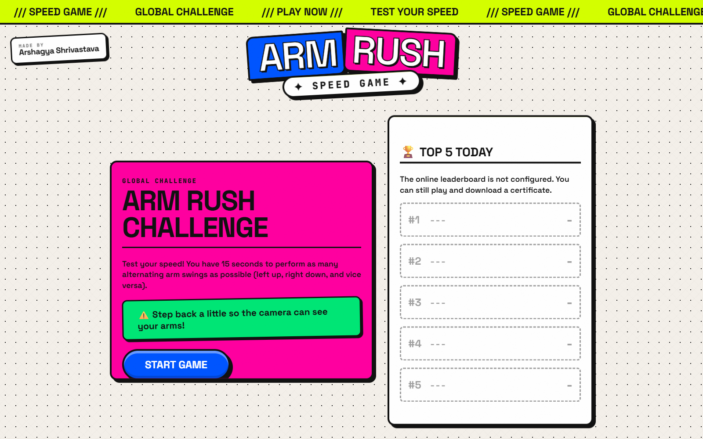
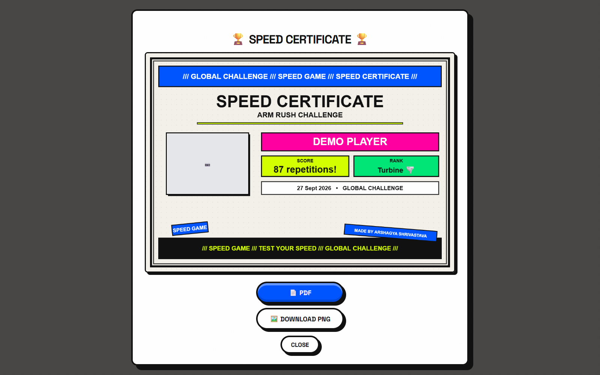
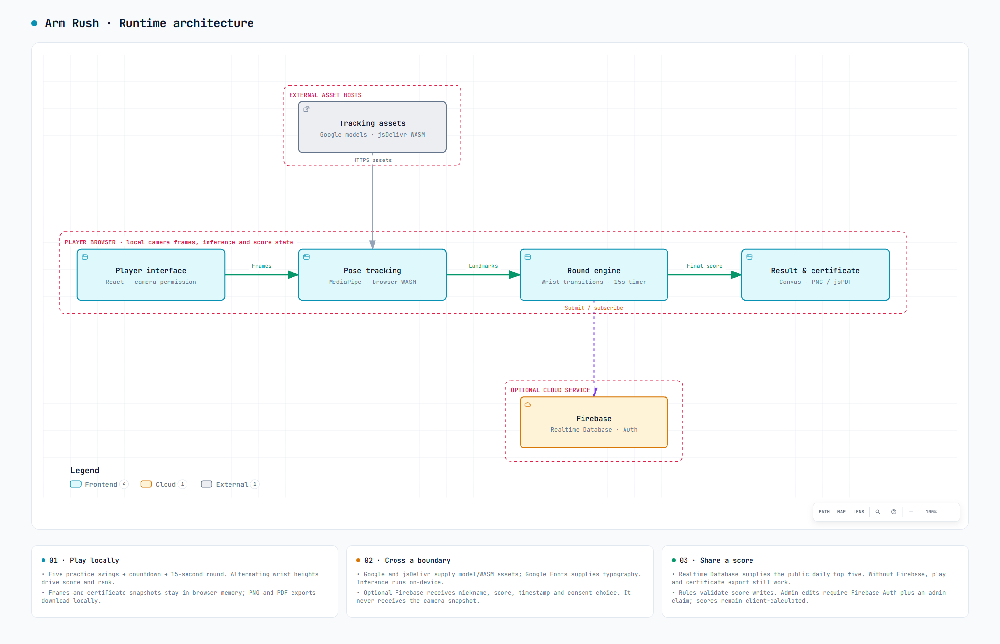

<div align="center">

# Arm Rush

### Your camera. Your movement. Fifteen seconds.

A motion-controlled arcade challenge, right in your browser.


[The experience](#the-experience) · [Play locally](#start-playing-locally) · [Architecture](#runtime-architecture) · [Development](#working-on-the-project)

</div>



<p align="center"><em>Five practice swings. A three-second countdown. One fifteen-second sprint.</em></p>

Arm Rush is a browser-based speed game that turns alternating arm movements into an arcade challenge. A webcam tracks your wrists while you race against the clock, build your score, and work through six ranks.

Play without an account, download a personalised result certificate, or connect a Firebase project to run a shared daily leaderboard. The interface is entirely in English.

## The experience

| Move | Chase | Keep |
| --- | --- | --- |
| Alternate left-arm-high and right-arm-high poses. MediaPipe tracks your wrists locally. | Race the timer, build combos, and climb through six ranks with reactive visual effects. | Download a personalised PNG or PDF certificate, or submit to an optional daily leaderboard. |

<details>
<summary><strong>See the certificate preview</strong></summary>



The real certificate frontend, opened with its supported deep link using **Demo Player** and an illustrative score of **87**. This is a preview, not a recorded round. Screenshots use a synthetic browser camera; no personal camera image is published.

</details>

## Runtime architecture

The primary path stays in the player's browser: camera frames become pose landmarks, wrist transitions become points, and the final score becomes a downloadable result. External asset loading and optional cloud scoring are separate branches.



[Interactive diagram](docs/architecture/runtime-overview.html) · [Editable Archify source](docs/architecture/runtime-overview.architecture.json) · [Code evidence and validation](docs/architecture/README.md)

Download the HTML file and open it in a browser for zoom, theme switching and export. GitHub displays the image above directly.

## Start playing locally

You will need:

- Node.js **22.13+ within the 22.x release line**, or **24+**, and npm. The included [`.nvmrc`](.nvmrc) selects Node.js 22.
- A browser with webcam access and WebAssembly support.
- A camera and enough space to keep both wrists visible.
- An internet connection to load the motion-tracking assets.

From the project directory:

```sh
npm ci
npm run dev
```

Open the local address printed in the terminal. No environment file or Firebase account is necessary for a local game.

### Your first round

1. Allow camera access and step back until your upper body and both wrists are in frame.
2. Select **Start Game** and complete the five practice swings.
3. After the countdown, alternate which arm is higher. Each recognised change earns one point.
4. Enter a nickname after the timer ends, then view your result or download a certificate.

Use steady lighting and keep both wrists in view. If tracking loses a wrist, the next detected pose establishes a new baseline instead of awarding a point.

## Enable a shared leaderboard

Firebase is an optional integration. Without it, the game keeps the current result in browser memory and offers certificate downloads without publishing a score. Refreshing the page or starting another round clears that local result.

To publish scores:

1. Register a web app in your own Firebase project and create a Realtime Database.
2. Copy [`.env.example`](.env.example) to `.env.local`.
3. Populate the following values using that project's configuration.
4. Apply [`database.rules.json`](database.rules.json) to the database before accepting submissions.
5. Restart the development server, or rebuild the app for deployment.

| Environment variable | Value to supply |
| --- | --- |
| `VITE_FIREBASE_API_KEY` | Firebase web app API key |
| `VITE_FIREBASE_AUTH_DOMAIN` | Authentication domain |
| `VITE_FIREBASE_PROJECT_ID` | Project identifier |
| `VITE_FIREBASE_DATABASE_URL` | Full Realtime Database URL |
| `VITE_FIREBASE_APP_ID` | Firebase web app identifier |

All five values must be present to enable the integration. These are client-side configuration values: never place service-account credentials or other private server keys in a `VITE_` variable.

The leaderboard shows the top five entries for the viewer's current local day. Daily filtering changes what is displayed; it does not delete stored records. Scores are calculated in the browser, so the leaderboard is intended for casual play rather than server-verified competition.

### Administration

Enable Email/Password authentication in Firebase and create an administrator account. Use trusted Firebase Admin SDK tooling to assign that account the Boolean custom claim `admin: true`, preserving any existing claims. Refresh the account's sign-in session after changing its claims.

The administration screen is available at `/?admin=1`. The database rules permit public creation of valid score entries, but require the administrator claim for edits and deletions. The page URL and a successful sign-in do not, by themselves, grant those permissions.

## Motion tracking and data handling

Arm Rush uses **MediaPipe Pose Landmarker** to estimate wrist positions. Pose inference runs in the browser; gameplay code counts transitions between the two arm positions.

The app selects the Lite, Full, or Heavy model using device-capability heuristics. Model files are fetched from Google's MediaPipe hosting, the matching WebAssembly runtime is loaded through jsDelivr, and fonts are requested from Google Fonts. The model is not packaged inside this repository, and a fully offline startup is not supported.

**Camera data stays local during normal gameplay.** The application processes video frames in the browser and captures a still image for the result certificate. That image remains in memory unless the player downloads a certificate; the score-submission flow does not upload it.

When online scoring is enabled, submitting a result sends the nickname, score, timestamp, and promotional-consent choice to the configured Firebase database. Submitted leaderboard records are publicly readable. Promotional consent is a separate, optional checkbox and starts unchecked.

## Working on the project

The application uses React and Vite for the frontend, MediaPipe Tasks Vision for tracking, jsPDF and Canvas for certificate generation, and Firebase for optional persistence and administrator authentication.

### Commands

| Command | Purpose |
| --- | --- |
| `npm run dev` | Start the development server |
| `npm run build` | Generate the production site in `dist/` |
| `npm run preview` | Serve the production build locally |
| `npm test` | Run the application test suite once |
| `npm run test:watch` | Run application tests in watch mode |
| `npm run test:rules` | Verify database permissions against a running local emulator |
| `npm run lint` | Report ESLint findings |

Application tests cover scoring, rank boundaries, tracking loss, loading retries, score-submission behaviour, English-only text, and operation without Firebase.

The [CI workflow](.github/workflows/ci.yml) installs dependencies, runs the application tests, and builds the production site. Database-rule tests are separate: they require the Realtime Database emulator at `127.0.0.1:9007` and operate only on the disposable `demo-arm-rush-rules` namespace, whose test data is reset between cases.

ESLint currently reports outstanding React hook/export and unused-code findings. Lint is available for development but is not an enforced CI check.

### Source layout

```text
src/
  App.jsx          Round lifecycle and screen transitions
  gameLogic.js     Arm-position classification
  firebase.js      Optional backend initialisation
  translations.js  English interface text
  components/      Camera, game UI, effects, and certificates
  hooks/           Shared UI behaviour and leaderboard subscription
  styles/          Layout, visual treatments, and responsive rules
  utils/           Device profiles and tracking-runtime configuration
  test/            Application regression tests
scripts/           Database-rule test runner
public/            Static assets
```

Commit the source, configuration, tests, and `package-lock.json`. Dependency folders, build output, caches, logs, and populated environment files are excluded by [`.gitignore`](.gitignore).

## Publishing the app

Run `npm run build` and serve the resulting `dist/` directory on a static host with **HTTPS**. Camera access requires a secure context; localhost is suitable for development.

Supply any Firebase configuration before building. Environment changes require a new build, and database-rule updates must be applied separately to Firebase. For hosting under a URL subdirectory, configure Vite's base path to match that location.

Use `npm run preview` to inspect a production build before deployment.

---

Developed and maintained by **Arshagya Shrivastava**.
